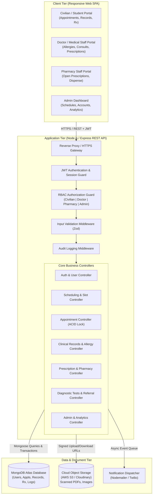
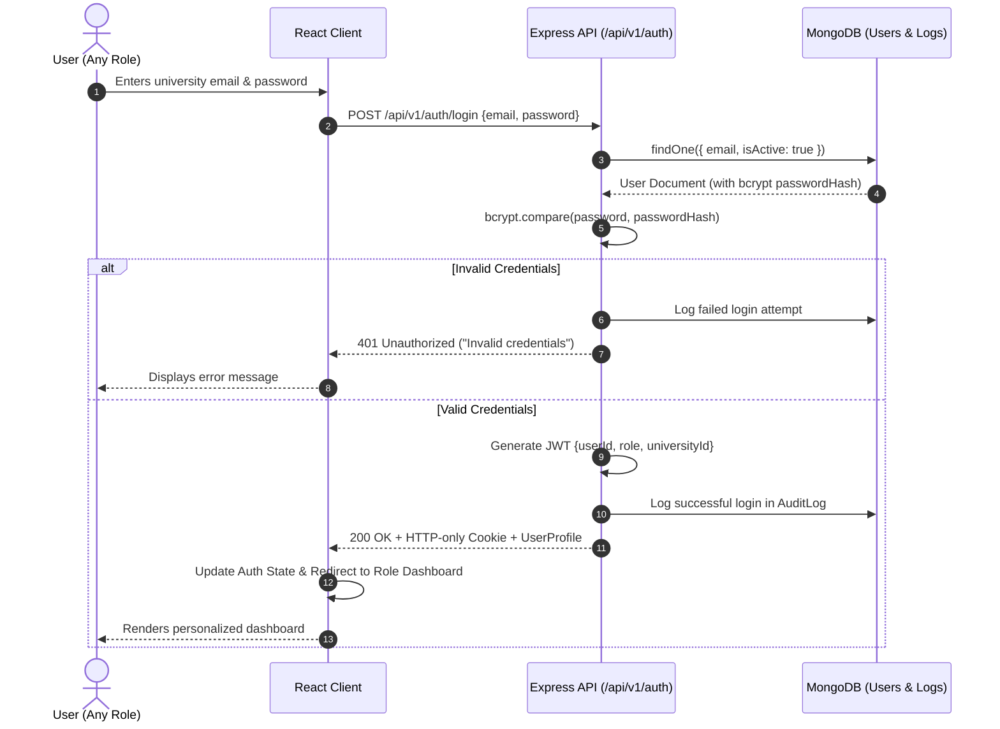
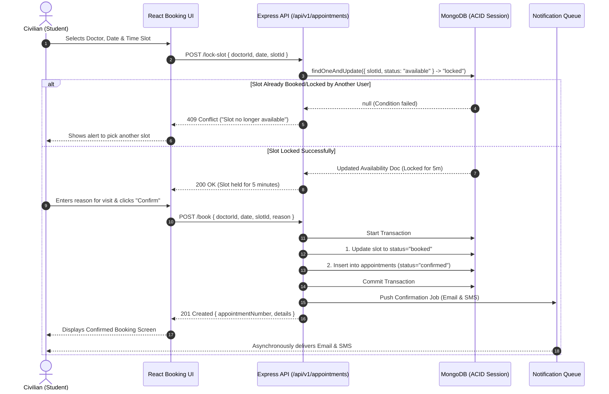
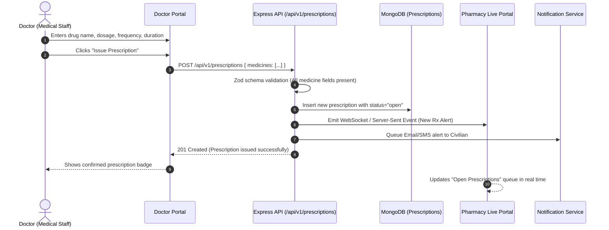
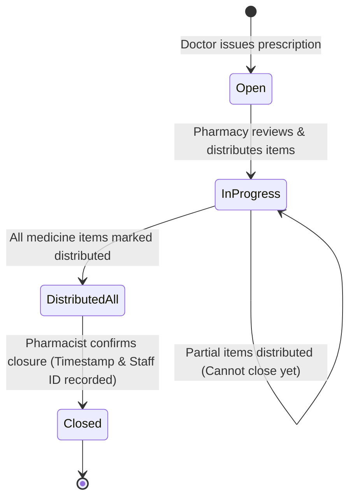
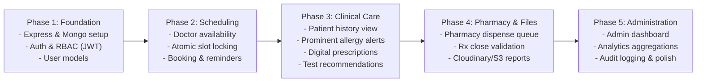

# UniHealth — Complete System Architecture, Tech Stack & Feature Pipelines

> **Document Type:** System Architecture & Technical Implementation Blueprint  
> **Target Project:** UniHealth — Integrated University Health Center Portal  
> **Source Documents:** UniHealth Vision Document (v1.0) & Software Requirements Specification (SRS v1.0)  
> **Audience:** Developers, AI/LLM Coding Agents, System Architects, Quality Engineers  
> **Primary Stack:** MERN (MongoDB, Express.js, React, Node.js) with TypeScript  

---

## 1. Executive Summary & System Objectives

UniHealth is a centralized, role-based healthcare management web platform engineered specifically for university and college health centers. Campus clinics typically struggle with fragmented manual records, paper charts, walk-in congestion, and lack of real-time visibility into doctor availability, creating risks such as overlooked allergies or medical histories during quick consultations.

UniHealth replaces disparate spreadsheets and paper forms with an integrated 3-tier web portal serving four distinct user roles:
1. **Civilian (Student / University Member):** Self-service appointment scheduling, personal medical history review, digital prescription access, and clinical test report viewing/downloading.
2. **Doctor / Nurse (Medical Staff):** Rapid patient record and critical allergy alert retrieval at point of care, consultation recording, digital prescription issuance, diagnostic test ordering, and specialist referrals.
3. **Pharmacy Staff:** Real-time visibility into open prescriptions, item-by-item medicine dispensation tracking, and formal prescription closure.
4. **Administrator:** Clinic-wide doctor scheduling and availability configuration, user account administration, audit log inspection, and operational analytics (patient volume, peak consultation hours, no-show rates).

---

## 2. Technology Stack & Rationale

```
+---------------------------------------------------------------------------------------+
|                                    UNIHEALTH TECH STACK                                |
+---------------------------------------------------------------------------------------+
| Frontend:            React 18+ (Vite) / TypeScript / Tailwind CSS / Lucide-React      |
| State & Data:        TanStack Query (React Query) / Axios / Zustand                    |
| Backend API:         Node.js 20+ LTS / Express.js 4+ (REST) / TypeScript               |
| Authentication:      JWT (HTTP-only cookies / Bearer headers) + Bcrypt password hash   |
| Database:            MongoDB Atlas 7.0+ (Mongoose 8+ ODM with ACID Transactions)      |
| Cloud File Storage:  Cloudinary / AWS S3 (Signed URLs for secure medical PDFs/images)  |
| Notifications:       Nodemailer (SMTP/SendGrid) for Email, Twilio API for SMS          |
| Security & Guard:    Helmet.js, express-rate-limit, Zod input validation, CORS        |
| Hosting & DevOps:    Frontend on Vercel, Backend on Render/Railway, Mongo on Atlas    |
+---------------------------------------------------------------------------------------+
```

### Detailed Tech Stack Justification

| Layer | Technology | Justification & Role in UniHealth |
|---|---|---|
| **Frontend Framework** | **React (with Vite & TypeScript)** | Enables fast, component-driven single-page application (SPA) rendering across desktop PCs and mobile devices. Type safety ensures clean API contracts. |
| **Styling & Icons** | **Tailwind CSS + Lucide Icons + shadcn/ui** | Rapid, accessible, and responsive UI composition. Prominent visual badges for **Allergy & Critical Condition Alerts** (mandatory safety requirement). |
| **Client State & Cache** | **TanStack Query (React Query)** | Auto-caching, background refetching, and optimistic updates for doctor slots, preventing stale appointment data. |
| **Backend Runtime & Framework**| **Node.js + Express.js (TypeScript)** | Lightweight, event-driven I/O ideal for concurrent booking requests, RESTful modular routing, and clean middleware chains (Auth, RBAC, Validation). |
| **Database & ODM** | **MongoDB Atlas + Mongoose ODM** | Document-oriented model mirrors clinical domain structures (prescriptions with nested drug lists, patient histories with dynamic timeline events). Native indexing and multi-document ACID transactions for slot booking concurrency. |
| **Object File Storage** | **Cloudinary or AWS S3** | Medical test reports and scanned records (PDF, PNG, JPEG) must never bloat MongoDB documents. Pre-signed upload/download URLs keep files secure and performant. |
| **Communications Gateway** | **Nodemailer / Twilio** | Asynchronous dispatch of appointment confirmations, 24h reminders, lab test notifications, and pharmacy ready-alerts. |
| **Security Layer** | **JWT + Bcrypt + Zod + Helmet** | Strict role-based access control (RBAC), password hashing with salt rounds >= 10, schema-level payload sanitization, and defense against XSS/CSRF. |

---

## 3. High-Level System Architecture

UniHealth implements a **Three-Tier Architecture** enriched with an asynchronous integration layer for cloud storage and communication gateways.



---

## 4. Role-Based Access Control (RBAC) Matrix

| Feature / Resource | Civilian / Student | Doctor / Nurse | Pharmacy Staff | Administrator |
|---|:---:|:---:|:---:|:---:|
| **User Registration / Profile** | Read/Update Self | Read/Update Self | Read/Update Self | Full CRUD (All Users) |
| **Doctor Availability Schedule** | Read (Available Slots) | Read/Write (Self) | Read | Full CRUD (All Doctors) |
| **Appointment Booking & Slot Lock** | Create (Self), Cancel (Self) | Read (Schedule) | None | Read / Override |
| **Patient Medical History & Allergies** | Read (Self) | Read/Write (Any Patient) | None | Read (Audit only) |
| **Critical Allergy Banners** | Read (Self) | **Prominently Surfaced** | Read (Relevant meds) | Read |
| **Add Digital Prescription** | None | Create / Update (Self) | None | Read |
| **Close Prescription / Dispense** | None | None | Read / Update ("closed") | Read |
| **View Prescribed Medicines** | Read (Self) | Read (Patients) | Read (All Open) | Read |
| **Add Lab Tests / Referrals** | None | Create (For Patient) | None | Read |
| **Upload Clinical Reports** | Upload / Read (Self) | Upload / Read (Patients) | None | Read / Manage |
| **Clinic Analytics & Metrics** | None | None | None | Full Access |
| **Audit Logs Inspection** | None | None | None | Read Only |

---

## 5. Database Schema & Data Models

### 5.1 User Entity (`users` collection)
```typescript
interface IUser {
  _id: ObjectId;
  universityId: string;       // e.g. "24CSB1A27" (Unique indexed)
  name: string;
  email: string;              // e.g. "student@univ.edu" (Unique indexed)
  passwordHash: string;
  role: 'civilian' | 'doctor' | 'pharmacy' | 'admin';
  phone?: string;
  department?: string;        // for students or staff
  specialization?: string;    // for doctors (e.g., "General Medicine", "Dermatology")
  isActive: boolean;
  createdAt: Date;
  updatedAt: Date;
}
```

### 5.2 Doctor Availability & Slot Entity (`doctor_availabilities` collection)
```typescript
interface IDoctorAvailability {
  _id: ObjectId;
  doctorId: ObjectId;         // Ref: User
  date: string;               // ISO "YYYY-MM-DD" (Indexed)
  slots: Array<{
    slotId: string;           // e.g. "2026-10-05T09:00:00"
    startTime: string;        // "09:00"
    endTime: string;          // "09:30"
    status: 'available' | 'locked' | 'booked';
    lockedUntil?: Date;       // For temporary concurrency lock during checkout
    appointmentId?: ObjectId; // Ref: Appointment once booked
  }>;
  createdAt: Date;
  updatedAt: Date;
}
// Unique compound index: { doctorId: 1, date: 1 }
```

### 5.3 Appointment Entity (`appointments` collection)
```typescript
interface IAppointment {
  _id: ObjectId;
  appointmentNumber: string;  // Unique human-readable: "APT-2026-1001"
  civilianId: ObjectId;       // Ref: User (Student)
  doctorId: ObjectId;         // Ref: User (Doctor)
  date: string;               // "YYYY-MM-DD"
  timeSlot: {
    startTime: string;        // "09:00"
    endTime: string;          // "09:30"
  };
  reasonForVisit: string;
  status: 'confirmed' | 'completed' | 'cancelled' | 'no-show';
  cancellationReason?: string;
  createdAt: Date;
  updatedAt: Date;
}
// Indexes: { civilianId: 1, date: -1 }, { doctorId: 1, date: 1 }
```

### 5.4 Medical Record & Allergy Profile (`medical_records` collection)
```typescript
interface IMedicalRecord {
  _id: ObjectId;
  civilianId: ObjectId;       // Ref: User (Student) - Unique
  bloodGroup: 'A+' | 'A-' | 'B+' | 'B-' | 'AB+' | 'AB-' | 'O+' | 'O-';
  allergies: Array<{
    allergen: string;         // e.g. "Penicillin", "Sulfa Drugs", "Peanuts"
    severity: 'mild' | 'moderate' | 'critical';
    notes?: string;
  }>;
  chronicConditions: string[]; // e.g. ["Asthma", "Type 1 Diabetes"]
  visitHistory: Array<{
    appointmentId: ObjectId;
    date: Date;
    doctorId: ObjectId;
    symptoms: string[];
    diagnosis: string;
    clinicalNotes: string;
  }>;
  updatedAt: Date;
}
```

### 5.5 Prescription Entity (`prescriptions` collection)
```typescript
interface IPrescription {
  _id: ObjectId;
  prescriptionNumber: string; // Unique: "RX-2026-0042"
  appointmentId: ObjectId;    // Ref: Appointment
  civilianId: ObjectId;       // Ref: User
  doctorId: ObjectId;         // Ref: User
  status: 'open' | 'closed';
  medicines: Array<{
    name: string;             // e.g. "Amoxicillin"
    dosage: string;           // e.g. "500mg"
    frequency: string;        // e.g. "1-0-1 (Twice daily after meals)"
    duration: string;         // e.g. "5 days"
    isDistributed: boolean;   // Controlled by Pharmacy
    notes?: string;
  }>;
  closedAt?: Date;
  closedBy?: ObjectId;        // Ref: User (Pharmacy staff)
  createdAt: Date;
  updatedAt: Date;
}
// Indexes: { civilianId: 1, status: 1 }, { status: 1, createdAt: -1 }
```

### 5.6 Diagnostic Test Recommendation (`diagnostic_tests` collection)
```typescript
interface IDiagnosticTest {
  _id: ObjectId;
  civilianId: ObjectId;       // Ref: User
  doctorId: ObjectId;         // Ref: User
  appointmentId?: ObjectId;
  testNames: string[];        // e.g. ["Complete Blood Count (CBC)", "Chest X-Ray"]
  clinicalInstructions: string;
  status: 'recommended' | 'sample_collected' | 'completed';
  createdAt: Date;
  updatedAt: Date;
}
```

### 5.7 Specialist Doctor Referral (`specialist_referrals` collection)
```typescript
interface ISpecialistReferral {
  _id: ObjectId;
  civilianId: ObjectId;       // Ref: User
  referringDoctorId: ObjectId;// Ref: User
  recommendedDoctorId: ObjectId; // Ref: User (Specialist in UniHealth)
  specialization: string;     // e.g. "Cardiology"
  clinicalReason: string;
  bookingStatus: 'pending_student_action' | 'booked';
  createdAt: Date;
}
```

### 5.8 Clinical Report Archive (`clinical_reports` collection)
```typescript
interface IClinicalReport {
  _id: ObjectId;
  civilianId: ObjectId;       // Ref: User
  uploadedBy: ObjectId;       // Ref: User (Civilian or Doctor)
  uploaderRole: 'civilian' | 'doctor';
  reportTitle: string;        // e.g. "Blood Chemistry Panel"
  fileUrl: string;            // Cloudinary / S3 URL
  fileType: 'pdf' | 'jpeg' | 'png';
  fileSize: number;
  reportDate: Date;
  notes?: string;
  createdAt: Date;
}
```

### 5.9 Audit Log Entity (`audit_logs` collection)
```typescript
interface IAuditLog {
  _id: ObjectId;
  actorId: ObjectId;          // User performing action
  actorRole: string;
  action: 'READ' | 'CREATE' | 'UPDATE' | 'DELETE' | 'LOGIN';
  entityName: 'User' | 'Appointment' | 'MedicalRecord' | 'Prescription' | 'Report';
  entityId: ObjectId;
  details: string;
  ipAddress: string;
  userAgent: string;
  timestamp: Date;
}
```

---

## 6. End-to-End Feature Pipelines & Execution Flows

Each pipeline describes the complete lifecycle of a user action from UI event to database update and background integration.

---

### Pipeline 1: User Authentication & Role-Based Session Management

#### 1. Stimulus / Trigger
A user (Civilian, Doctor, Pharmacy, or Admin) opens the UniHealth portal, fills the login form with their university credentials (`universityId` or `email` and `password`), and clicks **"Sign In"**.

#### 2. Pipeline Traversal & Steps
1. **Frontend (React UI):** Form validated using React Hook Form + Zod. Post request initiated via Axios: `POST /api/v1/auth/login`.
2. **Reverse Proxy & Rate Limiter:** `express-rate-limit` enforces max 5 failed attempts per 15 minutes per IP.
3. **Controller (`authController.login`):**
   - Sanitizes email/ID.
   - Queries `User` collection.
   - Compares plain password with stored bcrypt hash (`bcrypt.compare`).
   - If invalid: emits 401 Unauthorized and logs failed attempt in `AuditLog`.
4. **Token Generation:** Creates a signed JSON Web Token (JWT) containing `{ userId, role, universityId }` with a 24-hour expiration.
5. **Cookie / Response:** Sends token in secure, HTTP-only, SameSite cookie (plus user profile JSON in response body).
6. **Frontend State (Zustand):** Saves user metadata, sets role in application context, and redirects to the role-specific landing page:
   - Civilian -> `/dashboard/student`
   - Doctor -> `/dashboard/doctor`
   - Pharmacy -> `/dashboard/pharmacy`
   - Admin -> `/dashboard/admin`



---

### Pipeline 2: Doctor Schedule & Availability Management (Admin / Doctor)

#### 1. Stimulus / Trigger
An Administrator or Doctor configures weekly working hours or specific dates with 30-minute consultation slots.

#### 2. Pipeline Traversal & Steps
1. **Frontend:** Admin/Doctor accesses the Schedule Calendar at `/admin/schedules`, selects date range and shifts (e.g., 09:00 to 13:00, 30 min intervals), and clicks **"Save Schedule"**.
2. **API Middleware:** 
   - `verifyToken`: Checks JWT validity.
   - `requireRoles(['admin', 'doctor'])`: Blocks civilians or pharmacy staff.
3. **Controller (`scheduleController.configureSlots`):**
   - Calculates 30-minute discrete slots (e.g., 09:00-09:30, 09:30-10:00).
   - Prepares document: `{ doctorId, date, slots: [{ slotId, startTime, endTime, status: 'available' }] }`.
4. **Database Operation:** Uses `findOneAndUpdate` with `{ upsert: true }` on `{ doctorId, date }` so existing unbooked slots are updated without destroying active appointments.
5. **Response:** 200 OK with confirmed availability matrix.

---

### Pipeline 3: Doctor Availability Search & Atomic Appointment Booking (REQ_01 to REQ_06)

#### 1. Stimulus / Trigger
A Civilian needs an appointment. They select a department/specialization, pick a doctor and date, choose an available time slot, and click **"Confirm Booking"**.

#### 2. Critical Requirement — Concurrency & Slot Locking
To satisfy **REQ_04 ("lock selected time slot to prevent double-booking")**:
- Two concurrent students clicking the exact same slot at 10:00:00 AM must never both receive a confirmation.
- UniHealth executes an **atomic conditional update** in MongoDB (or multi-document transaction).

#### 3. Pipeline Traversal & Steps
1. **Frontend Request 1 (Fetch Availability):** 
   - `GET /api/v1/doctors/:doctorId/availability?date=2026-10-15`
   - Returns list of open slots with `status: 'available'`.
2. **Civilian Action (Slot Selection & Lock Request):**
   - Civilian clicks "09:30 - 10:00 AM".
   - Client sends `POST /api/v1/appointments/lock-slot` with `{ doctorId, date, slotId }`.
   - Backend executes atomic query:
     ```javascript
     DoctorAvailability.findOneAndUpdate(
       { doctorId, date, "slots.slotId": slotId, "slots.status": "available" },
       { 
         $set: { 
           "slots.$.status": "locked", 
           "slots.$.lockedUntil": new Date(Date.now() + 5 * 60 * 1000) // 5-minute hold
         } 
       },
       { new: true }
     );
     ```
   - If matched: slot is temporarily locked for 5 minutes. If null: slot was taken; user prompted to choose another.
3. **Civilian Action (Finalize Booking):**
   - Civilian enters visit reason and clicks "Confirm Appointment".
   - `POST /api/v1/appointments/book` with `{ doctorId, date, slotId, reasonForVisit }`.
4. **ACID Transaction Execution:**
   - Starts MongoDB Session transaction.
   - Confirms slot is locked by current user.
   - Sets slot status to `'booked'`.
   - Creates document in `appointments` collection with `status: 'confirmed'`.
   - Commits transaction.
5. **Asynchronous Notification Service:**
   - Triggers `notificationQueue.add('sendBookingConfirmation', { appointmentId, studentEmail, studentPhone })`.
   - Generates and dispatches email via Nodemailer & SMS via Twilio.
6. **Frontend Update:** Displays confirmed appointment card with unique `appointmentNumber` and "Add to Calendar" button.



---

### Pipeline 4: Patient Consultation, Medical History Retrieval & Critical Allergy Alerting (REQ 5.2)

#### 1. Stimulus / Trigger
Doctor opens their daily appointment queue and starts a consultation for the arriving patient.

#### 2. Safety Requirement
**"Allergy and critical-condition alerts shall be displayed prominently on a patient's profile so that they are immediately visible to medical staff, reducing the risk of harm."**

#### 3. Pipeline Traversal & Steps
1. **Frontend:** Doctor navigates to `/doctor/consultation/:appointmentId`.
2. **API Request:** `GET /api/v1/medical-records/patient/:civilianId`.
3. **Middleware:** Confirms requester has `role: 'doctor'`.
4. **Backend Retrieval:**
   - Queries `medical_records` collection by `civilianId`.
   - Populates past visit notes, chronic conditions, and allergy array.
5. **Frontend Rendering:**
   - **Top Priority Alert Banner:** If `allergies.length > 0` or severe chronic conditions exist, a high-contrast Red Alert Banner renders at the top of the consultation screen:
     > ⚠️ **CRITICAL ALLERGY ALERT:** Penicillin (Severity: CRITICAL), Peanuts (Mild). Chronic: Asthma.
   - The banner is sticky and cannot be dismissed during active consultation.
   - Doctor reviews past consultation history and enters new consultation notes.

---

### Pipeline 5: Adding a Digital Prescription & Pharmacy Dispatch (REQ_01 to REQ_04)

#### 1. Stimulus / Trigger
During or after consultation, Doctor prescribes medicines for the Civilian.

#### 2. Pipeline Traversal & Steps
1. **Frontend:** Doctor uses the prescription builder interface:
   - Adds medicine rows: `Name` (e.g. "Paracetamol"), `Dosage` (500mg), `Frequency` (1-0-1), `Duration` (3 days), `Notes`.
   - Clicks **"Issue Prescription"**.
2. **Validation:** Client & Zod validator verify mandatory fields for every medicine item: name, dosage, frequency, duration (satisfying **REQ_02**).
3. **API Request:** `POST /api/v1/prescriptions` with payload:
   ```json
   {
     "appointmentId": "651f8a...",
     "civilianId": "651f8b...",
     "medicines": [
       { "name": "Azithromycin", "dosage": "500mg", "frequency": "1-0-0", "duration": "3 days" }
     ]
   }
   ```
4. **Controller Execution:**
   - Generates human-readable `prescriptionNumber` ("RX-2026-XXXX").
   - Saves prescription with `status: "open"` (satisfying **REQ_03**).
   - Marks each medicine item with `isDistributed: false`.
5. **Pharmacy Notification (REQ_04):**
   - Emits real-time WebSocket event `new_prescription_available` to the Pharmacy channel.
   - Increments open prescription counter on the Pharmacy staff dashboard.
6. **Civilian Notification:** Email/SMS notification sent alerting student that a digital prescription is ready for pickup at the campus pharmacy.



---

### Pipeline 6: Diagnostic Lab Test Recommendations (REQ_01 to REQ_03)

#### 1. Stimulus / Trigger
Doctor determines that the student requires laboratory or diagnostic testing.

#### 2. Pipeline Traversal & Steps
1. **Frontend:** Doctor selects test types (e.g. "Complete Blood Count", "Malaria Smear") and enters clinical instructions, clicking **"Order Tests"**.
2. **API Endpoint:** `POST /api/v1/diagnostic-tests`.
3. **Backend Logic:**
   - Validates input.
   - Creates record in `diagnostic_tests` collection linked to `civilianId` and `appointmentId`.
   - Links test recommendation into the Civilian's `medical_records.visitHistory` entry.
4. **Notification (REQ_03):** 
   - Automated notification dispatched to Civilian: *"Dr. Smith recommended tests: CBC, Malaria Smear. Please visit the clinic lab."*
5. **Civilian Dashboard:** Recommended tests appear on the student's portal under "Pending Tests".

---

### Pipeline 7: Specialist Doctor Referral (REQ_01 to REQ_04)

#### 1. Stimulus / Trigger
Doctor determines that the student's condition requires a specialist (e.g., Orthopedist, Dermatologist).

#### 2. Pipeline Traversal & Steps
1. **Frontend:** Doctor opens referral modal:
   - Filters doctors registered in UniHealth by specialization.
   - Selects target specialist and enters clinical reason for referral.
   - Clicks **"Submit Referral"**.
2. **API Endpoint:** `POST /api/v1/referrals`.
3. **Backend Logic:**
   - Saves record in `specialist_referrals` collection with `bookingStatus: 'pending_student_action'`.
   - Associates referral with patient's medical history.
4. **Crucial Rule Execution (REQ_04):**
   - **The system does NOT automatically book the appointment.**
   - Instead, the referral generates a high-priority card on the student's dashboard:
     > *"Dr. Johnson has referred you to Specialist Dr. Patel (Cardiology). [Click Here to View Available Slots & Book]"*
5. **Notification:** Email and SMS sent to the student with the referral details and booking link.

---

### Pipeline 8: Pharmacy Distribution & Prescription Closure (REQ_01 to REQ_04)

#### 1. Stimulus / Trigger
Student arrives at the university pharmacy. Pharmacy staff accesses the open prescriptions dashboard.

#### 2. Pipeline Traversal & Steps
1. **Pharmacy View (REQ_01):**
   - Pharmacy staff navigates to `/pharmacy/queue`.
   - Searches by Student ID or Prescription Number.
   - System fetches all prescriptions with `status: 'open'`.
2. **Dispensation Tracking:**
   - For each drug on the prescription, pharmacy staff verifies stock, dispenses the medicine, and toggles `isDistributed: true`.
3. **Closure Validation (REQ_02):**
   - If pharmacy clicks "Close Prescription" while one or more items have `isDistributed === false`:
     - System rejects closure with error: *"All prescribed medicine items must be marked as distributed before closing."*
4. **Prescription Closure (REQ_03 & REQ_04):**
   - When all items are confirmed distributed:
   - Pharmacy staff clicks **"Complete & Close Prescription"**.
   - API call: `PATCH /api/v1/prescriptions/:id/close`.
   - Backend updates:
     - `status: "closed"`
     - `closedAt: new Date()`
     - `closedBy: req.user._id` (Pharmacist ID)
   - Writes event to `AuditLog`.
5. **Confirmation:** Prescription moves to the "Completed / Closed" archive.



---

### Pipeline 9: Clinical Report Upload & Document Archiving (Cloud Storage Integration)

#### 1. Stimulus / Trigger
A student or doctor uploads a scanned lab report, imaging result, or external document (PDF, PNG, JPEG).

#### 2. Pipeline Traversal & Steps
1. **Frontend:** User drags and drops file (max 10MB) into the upload zone at `/records/upload`.
2. **Secure Direct Upload Pipeline (AWS S3 or Cloudinary):**
   - **Step A:** Frontend requests pre-signed upload URL from backend: `POST /api/v1/reports/presigned-url` with `{ fileName, fileType }`.
   - **Step B:** Backend checks authorization and returns secure ephemeral URL.
   - **Step C:** Frontend uploads the binary directly to Cloud Storage (bypassing backend server load).
3. **Metadata Persistence:**
   - Frontend calls `POST /api/v1/reports` with `{ reportTitle, fileUrl, fileType, fileSize, civilianId }`.
   - Backend stores report metadata in `clinical_reports` collection.
   - If uploaded by doctor, links to patient's medical history.
4. **Viewing & Downloading (Civilian / Doctor):**
   - Authenticated user requests report: `GET /api/v1/reports/:id/download`.
   - Backend verifies RBAC (Civilian can only download their own reports; Doctor can access patients; others blocked).
   - Generates short-lived signed download URL (expires in 15 minutes).

---

### Pipeline 10: Administrative Analytics & Audit Logging (REQ 5.4 & 5.5)

#### 1. Stimulus / Trigger
Clinic administrator monitors clinic traffic, doctor workload, and system compliance.

#### 2. Pipeline Traversal & Steps
1. **Analytics Pipeline:**
   - Admin views `/admin/analytics`.
   - Frontend requests `GET /api/v1/admin/analytics?timeframe=monthly`.
   - Backend performs high-efficiency MongoDB Aggregation pipelines:
     - Total consultations per doctor
     - Ratio of completed vs. cancelled vs. no-show appointments
     - Peak appointment hours during the day
     - Most frequently prescribed medications (pharmacy stock forecasting)
2. **Audit Logging Pipeline:**
   - Every state-altering HTTP request passes through `auditMiddleware`.
   - Captures: `actorId`, `role`, `action`, `targetEntity`, `timestamp`, `IP`.
   - Inserted asynchronously into `audit_logs` collection.
   - Admin dashboard allows searching and filtering logs by student ID, doctor, or date range.

---

## 7. Recommended Project Directory Structure

```
unihealth-portal/
├── client/                               # React + Vite Frontend
│   ├── public/
│   ├── src/
│   │   ├── api/                          # Axios API clients & endpoints
│   │   │   ├── auth.api.ts
│   │   │   ├── appointments.api.ts
│   │   │   ├── records.api.ts
│   │   │   ├── prescriptions.api.ts
│   │   │   └── admin.api.ts
│   │   ├── components/                   # Reusable UI Components
│   │   │   ├── common/                   # Buttons, Modals, Badges, Table
│   │   │   ├── alerts/                   # Critical Allergy Banner
│   │   │   ├── appointments/             # Slot Picker, Calendar Widget
│   │   │   └── prescriptions/            # Rx Builder, Dispense Checkbox
│   │   ├── contexts/                     # AuthContext, NotificationContext
│   │   ├── hooks/                        # Custom React Hooks (useAuth, useSlots)
│   │   ├── layouts/                      # AppLayout, DashboardLayout, Navbar
│   │   ├── pages/                        # Page Views per User Role
│   │   │   ├── auth/                     # Login, Register, ForgotPassword
│   │   │   ├── civilian/                 # Student Dashboard, Booking, MyRx
│   │   │   ├── doctor/                   # Doctor Schedule, Consult, NewRx
│   │   │   ├── pharmacy/                 # Rx Queue, Dispense Manager
│   │   │   └── admin/                    # Staff Mgmt, Schedules, Analytics
│   │   ├── types/                        # TypeScript Interfaces & DTOs
│   │   ├── utils/                        # Formatters, Date helpers, Constants
│   │   ├── App.tsx
│   │   └── main.tsx
│   ├── tailwind.config.js
│   ├── tsconfig.json
│   └── package.json
│
├── server/                               # Node.js + Express Backend
│   ├── src/
│   │   ├── config/                       # DB connection, Cloudinary/S3, Mailer
│   │   │   ├── db.ts
│   │   │   ├── storage.ts
│   │   │   └── mailer.ts
│   │   ├── controllers/                  # Route Controllers
│   │   │   ├── auth.controller.ts
│   │   │   ├── appointment.controller.ts
│   │   │   ├── availability.controller.ts
│   │   │   ├── medicalRecord.controller.ts
│   │   │   ├── prescription.controller.ts
│   │   │   ├── report.controller.ts
│   │   │   └── admin.controller.ts
│   │   ├── middleware/                   # Security & Request Processing
│   │   │   ├── auth.middleware.ts        # JWT validation
│   │   │   ├── rbac.middleware.ts        # Role authorization guard
│   │   │   ├── validate.middleware.ts    # Zod schema validation
│   │   │   ├── audit.middleware.ts       # Action logging
│   │   │   └── error.middleware.ts       # Global error handler
│   │   ├── models/                       # Mongoose Schemas & Models
│   │   │   ├── User.model.ts
│   │   │   ├── DoctorAvailability.model.ts
│   │   │   ├── Appointment.model.ts
│   │   │   ├── MedicalRecord.model.ts
│   │   │   ├── Prescription.model.ts
│   │   │   ├── DiagnosticTest.model.ts
│   │   │   ├── Referral.model.ts
│   │   │   ├── ClinicalReport.model.ts
│   │   │   └── AuditLog.model.ts
│   │   ├── routes/                       # Express Route Definitions
│   │   │   ├── auth.routes.ts
│   │   │   ├── appointment.routes.ts
│   │   │   ├── availability.routes.ts
│   │   │   ├── medicalRecord.routes.ts
│   │   │   ├── prescription.routes.ts
│   │   │   ├── report.routes.ts
│   │   │   └── admin.routes.ts
│   │   ├── services/                     # Business logic & 3rd party adapters
│   │   │   ├── appointment.service.ts    # Atomic slot reservation logic
│   │   │   ├── notification.service.ts   # Email/SMS dispatcher
│   │   │   └── analytics.service.ts      # Aggregation pipelines
│   │   ├── validators/                   # Zod Validation Schemas
│   │   ├── server.ts                     # Express App Entrypoint
│   │   └── index.ts
│   ├── tsconfig.json
│   ├── .env.example
│   └── package.json
│
├── docs/                                 # Project Documentation & SRS
│   ├── SRS_UniHealth.pdf
│   └── Vision_UniHealth.pdf
└── README.md
```

---

## 8. Non-Functional & Security Constraints Implementation Guide

### 8.1 Concurrency & Double-Booking Guard
- Never rely on simple `find` followed by `save` for doctor slots.
- Always utilize MongoDB atomic conditional updates (`findOneAndUpdate` with filter `{ status: "available" }`) or native MongoDB multi-document ACID transactions with `session.withTransaction()`.

### 8.2 Medical Data Privacy & Encryption
- In transit: HTTPS with TLS 1.3 enforced.
- At rest: MongoDB Atlas volume encryption (AES-256). Sensitive health fields (e.g. chronic conditions or specific clinical notes) can optionally apply field-level encryption.
- Direct downloads of clinical PDFs/images must use short-lived pre-signed URLs (10–15 min max expiry) rather than public bucket URLs.

### 8.3 Patient Safety & Allergy Surface Protocol
- The frontend consultation interface must enforce that the **Allergy & Critical Condition banner** is rendered in the topmost viewport row whenever a doctor accesses a patient file.
- The UI must render `severity: 'critical'` allergies in a high-visibility badge with clear icons (e.g., Lucide `AlertTriangle`).

### 8.4 Scalability & Performance Benchmarks
- Indexing mandatory on:
  - `User`: `{ email: 1 }`, `{ universityId: 1 }`
  - `DoctorAvailability`: `{ doctorId: 1, date: 1 }`
  - `Appointment`: `{ doctorId: 1, date: 1 }`, `{ civilianId: 1, date: -1 }`
  - `Prescription`: `{ status: 1, civilianId: 1 }`
- Endpoints serving doctor availability must respond within `< 250ms` under normal campus clinic load (~200 active users/day).

---

## 9. Phased Implementation Roadmap



1. **Phase 1: Core Foundation & Security**
   - Initialize Git repository and project structure.
   - Configure TypeScript on frontend and backend.
   - Implement User schema, password hashing, JWT issue/verify, and RBAC middleware.
2. **Phase 2: Availability & Booking Engine**
   - Implement Doctor Availability models and admin schedule generator.
   - Build atomic slot-locking API and booking flow with race-condition prevention.
   - Connect Nodemailer for appointment confirmations.
3. **Phase 3: Doctor Consultation & Clinical Features**
   - Develop Medical Record and Allergy models.
   - Build Doctor Consultation UI with top-level allergy alert banners.
   - Create Digital Prescription builder and Diagnostic Test recommender.
4. **Phase 4: Pharmacy Dispensation & Cloud Document Archiving**
   - Implement Pharmacy open prescription queue and item-by-item distribution tracker.
   - Implement prescription closure rule (closed only when all medicines distributed).
   - Integrate S3/Cloudinary for clinical test reports and pre-signed file access.
5. **Phase 5: Administration, Analytics & Audit Logging**
   - Develop Admin dashboard for user management and doctor profiles.
   - Build MongoDB aggregation pipelines for clinic analytics (visits, no-shows).
   - Implement audit logging middleware for all clinical reads and writes.
